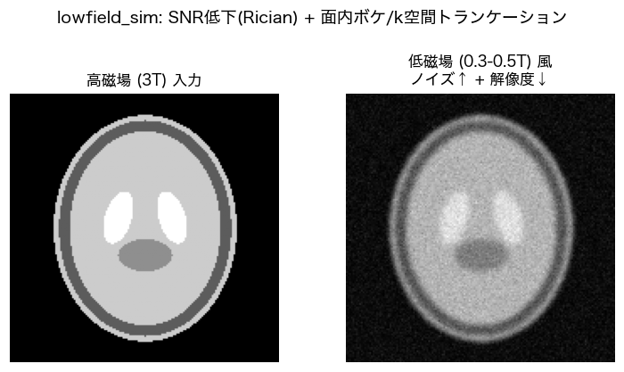

[← MRsimulation トップ](../README.md)

# 高磁場→低磁場シミュレーション (`lowfield_sim.py`)

1.5T/3Tの高画質MRIから、物理的に整合した **低磁場(0.3-0.5T)風の劣化画像** を合成する。
教師あり学習の **(入力=低磁場風 / 正解=高磁場)** ペア生成用。各スライスを独立処理し、
ジオメトリ（IPP/IOP/PixelSpacing）はそのまま保持する。

## モデル化する劣化

| 劣化 | 物理 | モデル |
|---|---|---|
| **SNR低下(主役)** | SNR ∝ B0^p (既定 p=1)。3T→0.5Tで約6倍ノイズ | **Rician**（複素ガウシアン→magnitude）。低SNRでノイズフロア/信号バイアスを再現 |
| **解像度低下/ボケ** | 大ボクセル・低マトリクス・再構成フィルタ | 面内ガウシアンPSF / k空間トランケーション(Gibbs) / ダウンサンプル |
| **T1短縮(任意・近似)** | T1 ∝ B0^α で低磁場ほど短縮 | 経験的コントラスト圧縮（既定OFF。厳密には定量マップが必要） |



*高磁場(3T)入力（左）に対し、SNR低下(Rician)と面内ボケ/k空間トランケーションで低磁場(0.3-0.5T)風に劣化させる（右）。*

## ノイズ量の決め方（「実画像と同等」にする鍵）

既存ノイズ `σ_high` を **画像コーナー(空気)の Rayleigh 統計** から実測し、磁場比でスケール:

```
σ_low = σ_high · (B0_high / B0_low)^p ,   σ_add = sqrt(σ_low² − σ_high²)
```

実際の低磁場画像があれば `--ref-low` でその背景から `σ_low` を直接実測して合わせられる
（最も実機に近い）。`--target-snr` / `--noise-sigma` で直接指定も可能。

## 使い方

```bash
# 3T -> 0.5T: 磁場比でノイズ、面内0.8mmボケ、k空間70%(Gibbs)
.venv/bin/python lowfield_sim.py highfield_dir lowfield_out --pattern "*.dcm" \
    --field-high 3.0 --field-low 0.5 --blur-mm 0.8 --kspace-keep 0.7

# 実低磁場画像の背景ノイズに合わせる
.venv/bin/python lowfield_sim.py highfield_dir lowfield_out \
    --ref-low real_lowfield_dir --in-plane-res 1.2

# 学習用に複数のノイズレベル/シードでデータ拡張
for s in 0 1 2; do
  .venv/bin/python lowfield_sim.py highfield_dir out_seed$s --seed $s --field-low 0.4
done
```

## 主なオプション

| オプション | 既定 | 説明 |
|---|---|---|
| `--field-high` / `--field-low` | `3.0` / `0.5` | SNRスケール用の磁場強度[T] |
| `--snr-exponent` | `1.0` | SNR ∝ B0^p の p（体雑音支配で≈1、コイル雑音支配で最大≈1.75） |
| `--target-snr` | — | 目標SNRを直接指定（σ_high推定を使わない） |
| `--noise-sigma` | — | 追加前の目標σを実値で直接指定 |
| `--ref-low` | — | 実低磁場シリーズの背景からσを実測して合わせる |
| `--blur-mm` | `0` | 面内ガウシアンPSF σ[mm] |
| `--in-plane-res` | — | 目標面内解像度[mm]（等価ボケに換算） |
| `--kspace-keep` | `1.0` | k空間中央の保持割合(0-1]。<1でGibbs/解像度低下 |
| `--downsample` | `1.0` | 取得解像度の縮小率(0-1]。<1で「縮小→ノイズ→補間で元サイズに戻す」 |
| `--downsample-to-mm` | — | 目標取得解像度[mm]を直接指定（ρ=入力ps/目標mm を自動算出） |
| `--upsample-order` | `1` | `--downsample`の拡大補間（1=線形/0=最近傍/3=3次） |
| `--save-lowres` | — | 真の低解像DICOM(小マトリクス)も別フォルダに出力 |
| `--t1-strength` | `0` | 低磁場T1短縮の近似強度[0-1]（近似なので注意） |
| `--profile` | — | `lowfield_calibrate.py` のコントラスト別プロファイル(.json)。実低磁場に合わせて上書き |
| `--seed` | `0` | 乱数シード（データ拡張用） |

---

## 実低磁場サンプルからの較正 (`lowfield_calibrate.py`)

**unpaired（高磁場と別患者）** の実低磁場サンプルから、**コントラスト別の劣化プロファイル**
を実測して JSON 化する。保存するのは**スケール不変量**だけなので別スキャナ/別患者の
高磁場へ転用できる。

| 実測量 | 内容 | 生成時の使われ方 |
|---|---|---|
| `target_snr` | 代表信号/ノイズσ（コーナー空気のRayleigh） | Ricianノイズ量を合わせる |
| `intensity_quantiles` | 前景輝度の正規化分位（コントラスト記述子） | **ヒストグラムマッチング**で低磁場の見た目（T1短縮等）を移植 |
| `resolution_mm` | 取得面内解像度(PixelSpacing) | 高磁場との差を等価ボケσに換算 |

```bash
# 各コントラストごとにプロファイルを作成（unpairedでOK）
python lowfield_calibrate.py real_low_T1    --name T1    --out prof_T1.json
python lowfield_calibrate.py real_low_T2    --name T2    --out prof_T2.json
python lowfield_calibrate.py real_low_FLAIR --name FLAIR --out prof_FLAIR.json

# 高磁場の同コントラストへ適用（ノイズ/解像度/コントラストを実低磁場に合わせる）
python lowfield_sim.py high_T1    out_T1    --profile prof_T1.json --pattern "*.dcm"
python lowfield_sim.py high_FLAIR out_FLAIR --profile prof_FLAIR.json --pattern "*.dcm"
```

`--profile` 指定時は `target_snr`・`resolution_mm`・`intensity_quantiles` が
`--field-*`/`--t1-strength` より優先される。

### profile設定後の微調整

profileを当てた結果がズレるとき、以下で後調整できる（profileを編集せずCLIで上書き）:

| 調整 | オプション | 用途 |
|---|---|---|
| **ボケすぎ/不足** | `--blur-scale`（既定1.0） | profile由来ボケの倍率。ボケすぎなら `0.5` 等、`0` で無効化 |
| ボケを足す | `--blur-mm` | profile由来ボケに上乗せ |
| **ノイズすぎ/不足** | `--noise-scale`（既定1.0） | 付加ノイズσの倍率。不足なら `1.5` 等 |
| ノイズ量(直接) | `--target-snr` / `--noise-sigma` | 明示するとprofileのSNRより優先 |
| **コントラスト強度** | `--contrast-strength`（既定1.0） | `1`=完全に低磁場へ / `0`=原画コントラスト / 中間でブレンド |
| リンギング | `--kspace-keep` | profileと併用してGibbsを追加 |

> ノイズが「量は合っているのに薄く見える」典型原因は、**実低磁場のノイズが白色でなく
> 粗く相関している**こと（ゼロフィル補間/低マトリクス取得で高周波が無い）。`--profile`
> 適用時は、低磁場の取得解像度 `resolution_mm` を相関長として**粗い相関ノイズ**を付加する
> （分散はtarget_snr通り・テクスチャだけ粗く）。`calibrate` で `corner σ ≫ laplacian σ` なら
> この相関ノイズの兆候。`--downsample` を使う場合は縮小→ノイズ→拡大で相関が入るため自動で考慮。
>
> ノイズが本当に少なすぎる別の原因は、**実低磁場の背景(空気)が0マスクされている**こと。
> コーナーからσを測ると0になり target_snr が過大 → ほぼ無ノイズになる。
> `lowfield_calibrate.py` は背景マスクを検出すると**組織内の高周波(Laplacian-MAD)から
> ノイズを実測**するフォールバックに切替える（calibrate出力に corner σ / laplacian σ と
> 採用理由を表示）。それでも合わなければ `--noise-scale` で微調整する。多コイル/PIで
> 中心ほどノイズが高い(g-factor)場合も、Laplacian推定は組織内ノイズを拾うため有効。

> ボケすぎる典型原因は、profileの取得解像度 `resolution_mm` が `AcquisitionMatrix` から
> 大きめに出るケース。まず `--blur-scale 0.5` 程度から実低磁場の見た目に合わせて調整する。
> 適用時は高磁場側も**取得解像度**で比較するので、両者ゼロフィルでも過剰ボケになりにくい。

## 低解像度で生成して元サイズに戻す（`--downsample`）

低磁場は低マトリクスで取得されるので、シミュレーションも一度**実際に解像度を落として**から
元サイズへ戻すのが物理的。`--downsample ρ` がこれを行う:

```
元(高解像) ──[アンチエイリアス縮小 ρ倍]──> 低解像 ──[Ricianノイズ]──> ──[線形補間で元サイズへ]──> 出力
```

- **縮小はアンチエイリアス付き**（目標ボクセル幅へ事前平滑化してから間引く＝エイリアス防止）。
- **ノイズは低解像で付加**するので、拡大後は実機どおりの粗い相関ノイズになる。
- **拡大は線形補間**（`--upsample-order 1`、既定）。`0`=最近傍, `3`=3次も選べる。
- 出力は**元サイズ**のDICOM（学習の入力/正解を同サイズに揃えられる）。

```bash
# ρ=0.5 で低解像化→線形補間戻し（元サイズ出力）
python lowfield_sim.py high_T2 out_T2 --downsample 0.5 --target-snr 8

# 真の低解像DICOM(小マトリクス)も同時に欲しい場合
python lowfield_sim.py high_T2 out_T2 --downsample 0.5 --save-lowres out_T2_lowres
```

`--save-lowres` は小マトリクス（例 512→256, PixelSpacing 2倍, FOV保持, IPP半画素補正）の
DICOMを別フォルダに出す。`--profile` と併用する場合は profile が ρ を持たないので
`--downsample` を明示する（profile由来ボケは二重適用を避けて自動で無効化される）。

### ρ（縮小率）の決め方

`--downsample ρ` は出力ボクセル = 入力PixelSpacing/ρ なので:

$$\rho = \frac{\text{入力(高磁場)の PixelSpacing}}{\text{実低磁場の取得解像度}}$$

ρを手計算する代わりに、**目標解像度[mm]を直接指定**できる（推奨）:

```bash
# 実低磁場の取得解像度 1.57mm に合わせる（ρは自動算出）
python lowfield_sim.py high_T2 out_T2 --downsample-to-mm 1.57 --target-snr 8
```

「実低磁場の取得解像度」は `lowfield_calibrate.py` が `acquired(AcqMatrix)=1.57mm` として出力する。
`lowfield_calibrate.py --high <高磁場>` を付ければ `推奨: --downsample-to-mm 1.57` まで提示する。

決め方は3通り:
1. **取得解像度から（推奨）**: calibrateの `acquired` 値を `--downsample-to-mm` に渡す。
2. **マトリクス比から**: ρ = 実低磁場の取得マトリクス / 高磁場マトリクス（同FOV時）。
3. **目視（無参照）**: `--limit` で数枚だけ生成し、実低磁場の鮮明さに合うよう `--downsample-to-mm`
   を増減（小さい目標mm=高精細, 大きい=低精細）。

## 解像度ノブ（`--downsample` / `--kspace-keep` / `--blur-mm`）の決め方

この3つは **同じ「解像度比 ρ = res_high / res_low」を別表現したもの**。低磁場ほど粗いので
0<ρ<1（例: 高磁場1mm・低磁場2mm → ρ=0.5）。

| ノブ | ρからの換算 | アーチファクト | いつ使う |
|---|---|---|---|
| `--blur-mm` (σ) | σ = √(res_low²−res_high²)/2.355 | 滑らかなボケ | 再構成フィルタ/T2ブラー的劣化、微調整 |
| `--kspace-keep` | keep = ρ | **Gibbsリンギング** | 実低磁場にリンギングが見える（低マトリクス取得） |
| `--downsample` | factor = ρ | 部分容積＋**相関ノイズ** | 大ボクセル取得を最も物理的に再現（学習データ推奨） |

ρ は **取得マトリクスから真の解像度** `res = FOV / AcquisitionMatrix` で求めるのが本筋
（再構成PixelSpacingはゼロフィル補間で見かけ細かく、真の解像度を反映しないことがある）。
`lowfield_calibrate.py --high <高磁場の同コントラスト>` を付けると、両者の取得解像度から
**ρ と各ノブの推奨値を自動算出**して表示・JSONに保存する:

```bash
python lowfield_calibrate.py real_low_T1 --name T1 --high high_T1 --out prof_T1.json
#   -> resolution: recon=0.50mm acquired=1.20mm
#      vs high-field acquired=0.50mm -> ρ=0.42  推奨: --downsample 0.42 | --kspace-keep 0.42 | --blur-mm 1.09
```

学習データなら `--downsample`(=ρ) を主に、リンギングが見えるなら `--kspace-keep`(=ρ) を併用、
`--blur-mm` は実低磁場の見た目に合わせる微調整に使う。`--profile` 適用時は profile の
`resolution_mm`（取得解像度）から `--blur-mm` 相当が自動で入る。

## 参照画像なしで目視調整するワークフロー

実低磁場が手元に無い/profileを使わず、出力を見ながら手で合わせる場合。各ノブはほぼ独立なので
**解像度 → ノイズ量 → ノイズの粗さ → 任意アーチファクト** の順で詰める。`--limit` で
数枚だけ生成すれば素早く反復できる。

```bash
# 数枚だけ生成して目視（反復を高速化）
python lowfield_sim.py high_T2 out_try --pattern "*.dcm" --limit 3 \
    --target-snr 8 --downsample 0.5 --noise-corr-mm 1.5
```

| 順 | 何を見る | ノブ | 目安 |
|---|---|---|---|
| 1 | **解像度/ボケ** | `--downsample ρ`（推奨）or `--blur-mm` | ρ=res_high/res_low。0.5T≈1.0–1.5mm, 0.3T≈1.5–2.0mm相当 |
| 2 | **ノイズ量** | `--target-snr`（or `--field-low`） | 組織がザラつくが構造は見える程度。低磁場ほど低SNR |
| 3 | **ノイズの粗さ** | `--noise-corr-mm` | 取得ボクセル相当（例1.5mm）。細かすぎ＝薄く見えるなら上げる |
| 4 | リンギング | `--kspace-keep ρ` | 実機にGibbsが見えるなら |
| 5 | T1コントラスト | `--t1-strength`（T1強調のみ） | 0.2–0.4程度から |

ポイント:
- **`--downsample` を主に使うと解像度低下と粗い相関ノイズが同時に入る**ので、まずこれだけで
  低磁場らしくなる。`--blur-mm`＋`--noise-corr-mm` で個別に詰めてもよい。
- ノイズが「量はあるのに薄い」ときは `--noise-corr-mm` を上げる（白色だと細かすぎる）。
- SNRの絶対値はシーケンス依存なので、数値にこだわらず**見た目で**合わせる。`--field-low` で
  おおよそ当て、`--target-snr`/`--noise-scale` で微調整。
- 決まったら `--limit` を外して全スライス生成。`--seed` を変えれば学習用に複数バリエーション。

## 手動ノイズ計測 (`measure_noise.py`)

自動推定が当てにならない時、ビューアで読み取ったROI座標 `x,y,w,h`（x=列,y=行）で
ノイズσ・SNRを手動計測できる。結果は `lowfield_sim --target-snr` にそのまま渡せる。

```bash
# 信号ROI + 背景ROI から SNR を測る（推奨: 実低磁場で測って高磁場へ適用）
python measure_noise.py MRP/hitachi025/T2AX --slice 10 \
    --signal-roi 220,210,30,30 --noise-roi 10,10,40,40
#   => SNR = signal/σ = ...   --target-snr <値> をそのまま使う

# 均一組織ROIだけで σ を測る（平坦部を選ぶ）
python measure_noise.py MRP/hitachi025/T2AX --noise-roi 200,200,20,20 --noise-region tissue

# ROI未指定なら自動推定(corner/laplacian)を表示
python measure_noise.py MRP/hitachi025/T2AX
```

- 背景(空気)ROI: Rayleigh統計で `σ = √(mean(M²)/2)`（単純std は Rayleigh で 0.655σ と過小になる）。
- 組織ROI: そのstdを直接ノイズとする（構造のない平坦部を選ぶこと）。
- `--slice all` で複数スライスをまとめて計測でき安定する。
- **`--target-snr`（SNR）はスケール不変**なので、実低磁場で測った値を高磁場へ適用するのに最適。
  `--noise-sigma`（σ実値）は同一スケールの時のみ。

## 異方性取得（AcquisitionMatrix）への対応

DICOM `AcquisitionMatrix` = `[周波数行, 周波数列, 位相行, 位相列]`（周波数/位相それぞれ片方のみ
非ゼロ）。例 `0\256\122\0` は **周波数=列方向256 / 位相=行方向122** ＝ 列256×行122 の
**異方取得**で、行方向(位相)が約2倍粗い（位相エンコードを間引いて高速化）。

低磁場は位相方向を粗くした異方取得が多い。`calibrate` は軸ごとの取得解像度を測って
`resolution_mm_axes` に保存し、`--profile` 適用時は **軸ごとに正しい解像度へ異方ブラー**を
かける（片軸を過剰にボカさない）。`calibrate` 出力に `軸別(行,列)=(1.80,0.86)mm ← 異方取得`
と表示される。

## 注意・限界

- **コントラスト変換は周辺分布のヒストグラムマッチング**（unpairedで可能な範囲）。
  同部位・同コントラストのサンプルを使うこと。per-pixelの厳密変換にはペアが必要。
- **解像度は取得PixelSpacingの差から換算**（スペクトルからの自動推定は強ノイズで
  不安定なため不採用）。低磁場がゼロフィル補間で見かけ高精細な場合は実解像度を
  反映しないので、その時は `--blur-mm` で明示的に補う。
- **単一コイル magnitude を仮定**（Rician）。パラレルイメージング/多コイルは
  noncentral-chi + 空間変動 g-factor になるため本ツールは近似（`target_snr` は実測値
  として妥当だが、g-factorの空間変動は平均化される）。
- **T1コントラスト変化は粗い近似**。T2強調など磁場ロバストなコントラストでは省略可。
  厳密化には定量マップ(T1/T2)＋信号方程式が必要。
- 低磁場の **厚いスライス** も同時に作る場合は `mri_slice_sim.py` と組み合わせる。
- 磁場比パスは入力に測定可能な背景ノイズがある前提。ほぼ無ノイズの入力では
  `--target-snr` / `--noise-sigma` を使う。

---

### 関連ページ

- [3D薄スライス → 2D厚スライス (`mri_slice_sim.py`)](slice-simulation.md) — 厚スライス化と併用
- [実ペアデータによる較正・検証 (`calibrate.py`)](calibration.md)
- [k-spaceからの再構成 (`recon_motion.py`)](recon-motion.md)
- [← トップへ戻る](../README.md)
